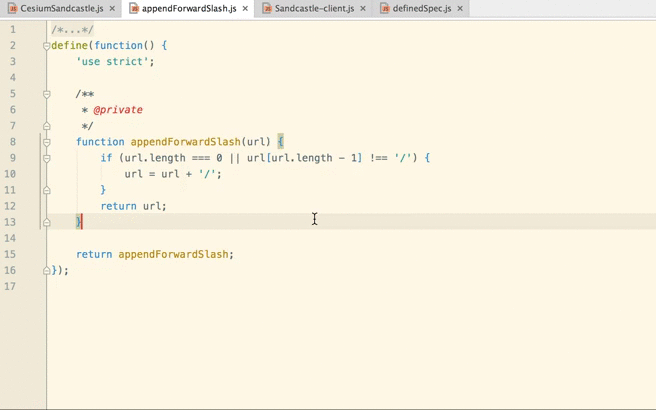

# Cesium WebStorm Plugin

Created by the [Cesium team](http://cesiumjs.org/) for Cesium development in [WebStorm](https://www.jetbrains.com/webstorm/). 

## Add The Plugin

1. Navigate to WebStorm settings
2. Click Plugins
3. Click Browse repositories...
4. Search for `Jump Source Spec`
5. Click Install

With this plugin, you can jump between source and specs files with a simple press of `alt + shift + k`.

## Contributions

Pull requests are appreciated! Please use the same [Contributor License Agreement (CLA)](https://github.com/AnalyticalGraphicsInc/cesium/blob/master/CONTRIBUTING.md) used for [Cesium](http://cesiumjs.org/).
